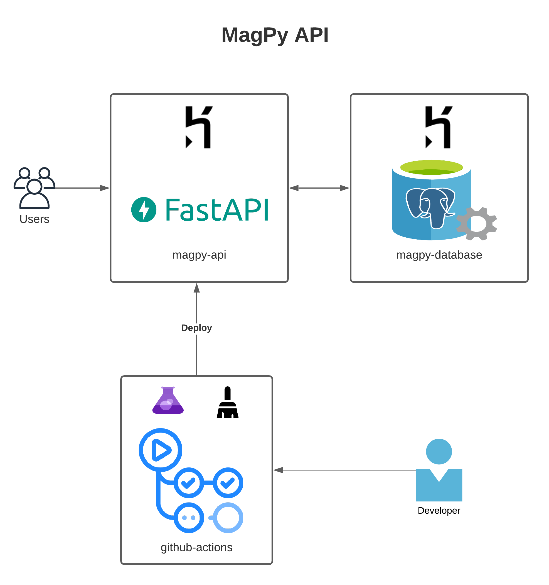

# Python Project Versioner

A Rest API to manage Python projects versioning.



## The Project

A REST API that manages a collection of Python projects.
Each project has a name and a list of packages.
Each package has a name and a version.

The registration of a project receives the name and list of packages. Each package from
list must specify a name, but version is optional.

The API validates a project: every package must be registered on [PyPI](https://pypi.org/).
When a package doesn't contains a version number, the mos recent one published on [PyPI](https://pypi.org/) is used.

Below are some examples of calls that will be made in this API:

```
POST /api/projects
{
    "name": "titan",
    "packages": [
        {"name": "Django"},
        {"name": "graphene", "version": "2.0"}
    ]
}
```
The HTTP code returned is 201 and the body of the response is:
```
{
    "name": "titan",
    "packages": [
        {"name": "Django", "version": "3.2.5"},  // Usou a versão mais recente
        {"name": "graphene", "version": "2.0"}   // Manteve a versão especificada
    ]
}
```

If one of the packages informed does not exist, or one of the specified versions is
invalid, an error should be returned.

For a call similar to the example below:
```
POST /api/projects
{
    "name": "titan",
    "packages": [
        {"name": "pypypypypypypypypypypy"},
        {"name": "graphene", "version": "1900"}
    ]
}
```
The HTTP return code is 400 and the body in the response is:
```
{
    "error": "One or more packages doesn't exist"
}
```

It should also be possible to visit previously registered projects using the
name in URL:
```
GET /api/projects/titan
{
    "name": "titan",
    "packages": [
        {"name": "Django", "version": "3.2.5"},
        {"name": "graphene", "version": "2.0"}
    ]
}
```

And delete projects by name:
```
DELETE /api/projects/titan
{
    "message": "Project deleted"
}
```

## Development

A `devcontainer` for vscode with all the necessary configurations for local development is available.

## Deploy

To setup the app for the first time, do the following:

- Create the heroku app: `$ heroku create <app-name>`
- Configure the following environment variables
  - Set the environment to production: `$ heroku config:set APP_ENV=prod`
  - Add the database, also created database url: `$ heroku addons:create heroku-postgresql:hobby-dev`
- Add the heroku remote: `$ heroku git:remote -a <app-name>`
- Push the app to heroku: `$ git push heroku heroku:main`

The openapi interface for the app will be available at `<app-url>/docs/`

Create the following secrets in your github repo:

- `HEROKU_EMAIL`: Your heroku email
- `HEROKU_APP_NAME`: The heroku app name
- `HEROKU_API_KEY`: An API key for your account. To create a new one, run: `$ heroku auth:token`

After setting up everything, `Github Actions` will take care of deploying your app on new releases
